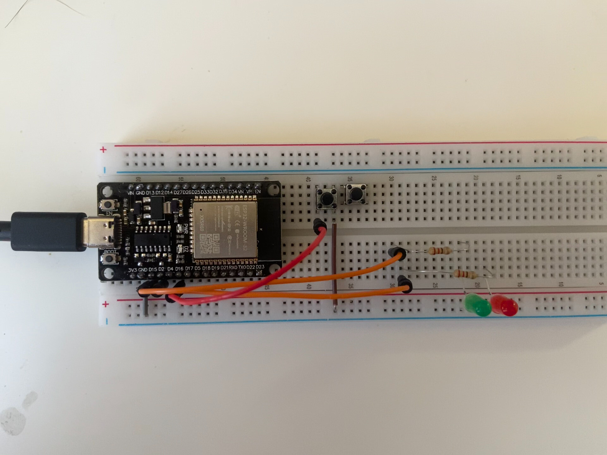

| Supported Targets | ESP32 | ESP32-C2 | ESP32-C3 | ESP32-C6 | ESP32-H2 | ESP32-P4 | ESP32-S2 | ESP32-S3 |
| ----------------- | ----- | -------- | -------- | -------- | -------- | -------- | -------- | -------- |

# A simple example use of freeRTOS on esp32 board.
Two tasks are created. One listens to button press and changes the system state.
Other task changes LEDs behaviour based on system state.


https://github.com/Abishevs/esp32-blinky-freeRTOS/assets/99913069/9c39baac-213d-45e5-87bb-ca519e28b5c3




## IMPORTANT
Before building, be sure to follow the [ESP-IDF Getting Started Guide](https://idf.espressif.com/) to ensure you have the required development environment.

## How to use
```bash
idf.py set-target TARGET
```
Where TARGET is one of the supported boards.
```bash
idf.py build 
```
This builds all the mandatory files and builds this source code aka main.c (this
might take a long time, depending on system resources).

Find the serial port of ESP32* board. 
(user might need to add $USER to uucp group):
```bash
sudo usermod -aG uucp $USER
```
Where PORT is e.g. /dev/ttyUSB0, if only one serial device is plugged then it is
the USB0.
Put board into boot mode (hold boot btn, press restart btn then release boot btn). 
Then initiate flashing sequence.
```bash
idf.py -p PORT flash
```
To open serial connection to the board.
```bash
idf.py -p PORT monitor
```

